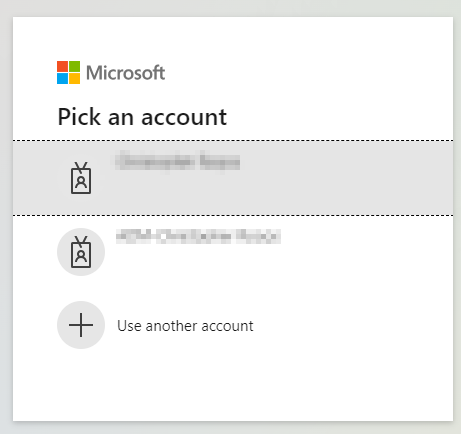

## Setup for Microsoft Azure

Example configuration with OpenID Connect authorization code flow.

1. configure a new web application in Azure with OpenID and code flow (see
the [provider
documentation](https://docs.microsoft.com/en-us/powerapps/maker/portals/configure/configure-openid-provider)))

2. in this application the redirect url must be be "\<url of your
server\>/auth_oauth/signin" and of course this URL should be reachable
from Azure

3. create a new authentication provider in Odoo with the following
parameters (see the [portal
documentation](https://docs.microsoft.com/en-us/powerapps/maker/portals/configure/configure-openid-settings)
for more information):

Single tenant provider limits the access to user of your tenant, while
Multitenants allow access for all AzureAD users, so user of foreign
companies can use their AzureAD login without an guest account.

- Provider Name: Azure AD Single Tenant
- Client ID: Application (client) id
- Client Secret: Client secret
- Allowed: yes
- replace {tenant_id} in urls with your Azure tenant id

or

- Provider Name: Azure AD Multitenant
- Client ID: Application (client) id
- Client Secret: Client secret
- Allowed: yes

- Auth Link Params: Add {'prompt':'select_account'} to the auth link to get the account selection screen

## Setup for Keycloak

Example configuration with OpenID Connect authorization code flow.

In Keycloak:

1. configure a new Client
2. make sure Authorization Code Flow is
Enabled.
3. configure the client Access Type as "confidential" and take
note of the client secret in the Credentials tab
4. configure the
redirect url to be "\<url of your server\>/auth_oauth/signin"

In Odoo, create a new Oauth Provider with the following parameters:

- Provider name: Keycloak (or any name you like that identify your
  keycloak provider)
- Auth Flow: OpenID Connect (authorization code flow)
- Client ID: the same Client ID you entered when configuring the client
  in Keycloak
- Client Secret: found in keycloak on the client Credentials tab
- Allowed: yes
- Body: the link text to appear on the login page, such as Login with
  Keycloak
- Scope: openid email
- Authentication URL: The "authorization_endpoint" URL found in the
  OpenID Endpoint Configuration of your Keycloak realm
- Token URL: The "token_endpoint" URL found in the OpenID Endpoint
  Configuration of your Keycloak realm
- JWKS URL: The "jwks_uri" URL found in the OpenID Endpoint
  Configuration of your Keycloak realm
