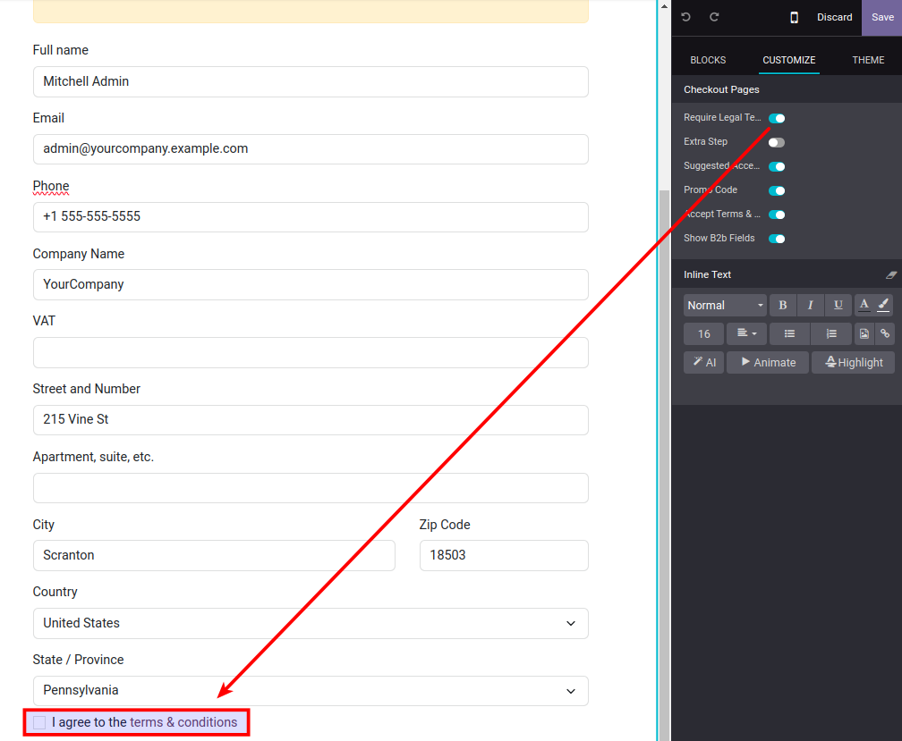
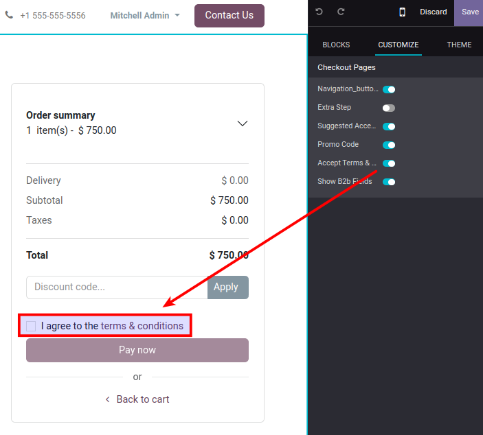

To configure this module, you need to:

1.  Install it.

2.  Set up [your legal pages](/legal).

3.  Go to your e-commerce and make a sample checkout.

4.  Visit [/shop/address](/shop/address) and enable in the web editor *Customize \>
    Require Legal Terms Acceptance*.

    

    This will require acceptance before recording a new address, and log
    visitor's acceptance.

5.  Visit [/shop/payment](/shop/payment) and enable in the web editor *Customize \>
    Accept Terms & Conditions* (upstream Odoo feature).

    

    This will require acceptance before paying the sale order, and log
    visitor's acceptance.
